  

   

  
  
  

    I am a Computer Science Engineering student who is deeply passionate about technology. I love learning new tools, building projects, and constantly expanding my skill set in both frontend and backend development!
  

  
  

---

### ⚡ About Me

<picture>
<source media="(prefers-color-scheme: dark)" srcset="https://media2.giphy.com/media/v1.Y2lkPTc5MGI3NjExMGtnYXlmNWpxOG9nbjFzYWt2MTN3cmltYmhuc2pxcnRwcGdvYTNuNiZlcD12MV9pbnRlcm5hbF9naWZfYnlfaWQmY3Q9Zw/h408T6Y5GfmXBKW62l/giphy.gif">
<source media="(prefers-color-scheme: light)" srcset="https://media2.giphy.com/media/v1.Y2lkPTc5MGI3NjExNzZydmVyeWNmdG5wcHB1Ymwza2JpYXZnOXN5NWt1cHJzY3lwbjFuOCZlcD12MV9pbnRlcm5hbF9naWZfYnlfaWQmY3Q9Zw/MeJgB3yMMwIaHmKD4z/giphy.gif">

</picture>

* 🎓 Currently studying Computer Science Engineering.
* 🌱 I’m focused on sharpening my full-stack web development and problem-solving skills.
* 💡 Always eager to collaborate on fun projects and learn new frameworks.
* 📫 Feel free to reach out to me on LinkedIn for collaborations.

 

---

### 🚀 Featured Project

**My Meowcat:** My latest interactive web project showcasing clean and engaging digital experiences! 
  * 🔗 **Live Demo:** [https://my-meowcat.vercel.app/](https://my-meowcat.vercel.app/)

 

---

### 💻 My Tech Stack

&emsp;&emsp;&emsp;&emsp;

&emsp;&emsp;&emsp;&emsp;

 

---

### 📊 GitHub Stats & Activity

  <picture>
    <source media="(prefers-color-scheme: dark)" srcset="./profile/stats-dark.svg">
    <source media="(prefers-color-scheme: light)" srcset="./profile/stats-light.svg">
    
  </picture>
   
   
  

---

### 🟩 GitHub Contribution Graph

  <picture>
    <source media="(prefers-color-scheme: dark)" srcset="https://raw.githubusercontent.com/varshajangid07/varshajangid07/output/github-contribution-grid-snake-dark.svg">
    <source media="(prefers-color-scheme: light)" srcset="https://raw.githubusercontent.com/varshajangid07/varshajangid07/output/github-contribution-grid-snake.svg">
    
  </picture>

 
    

   
 
    

  

  
